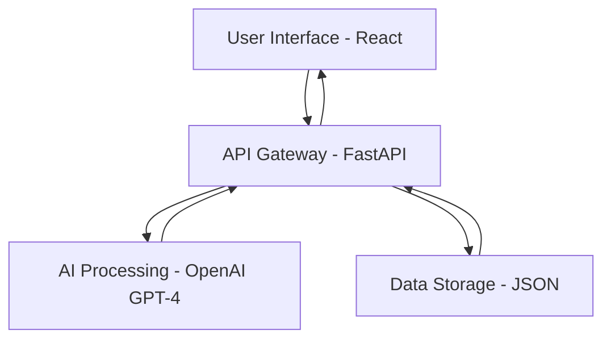

# 📋 Project Overview

## Healthcare Chatbot - Comprehensive Analysis

### 🎯 Purpose & Vision

The Healthcare Chatbot is designed to bridge the gap between initial health concerns and professional medical care. It provides:

1. **Immediate Response**: 24/7 availability for health-related queries
2. **Preliminary Guidance**: Evidence-based suggestions for common symptoms
3. **Safety Prioritization**: Smart escalation to healthcare professionals when needed
4. **Educational Value**: Health literacy improvement through interactive dialogue

### 🏗️ System Architecture

#### High-Level Components

#### Technology Stack Deep Dive

**Frontend Layer:**
- **React 18** with TypeScript for type safety
- **Modern CSS** with Flexbox/Grid for responsive design
- **Axios** for HTTP client communication
- **Component-based architecture** for maintainability

**Backend Layer:**
- **FastAPI** for high-performance API development
- **Pydantic** for data validation and serialization
- **CORS middleware** for cross-origin requests
- **Uvicorn** as ASGI server

**AI Layer:**
- **OpenAI GPT-4** for natural language understanding
- **Custom system prompts** for healthcare-specific responses
- **Severity classification** algorithm
- **Context-aware conversation handling**

**Data Layer:**
- **JSON file storage** for simplicity and portability
- **Structured conversation schema**
- **Timestamp tracking** for interaction history
- **Severity metadata** for analytics

### 🎨 User Experience Design

#### Chat Interface Philosophy
The UI follows modern chat application patterns:

- **Bubble-based messaging** similar to WhatsApp/iMessage
- **Color coding** for message types and severity levels
- **Smooth animations** for enhanced user engagement
- **Responsive design** for mobile and desktop compatibility

#### Interaction Flow
1. **Welcome Message**: Sets expectations and provides context
2. **Symptom Input**: User describes their health concerns
3. **AI Processing**: GPT-4 analyzes and formulates response
4. **Categorized Response**: Advice with severity assessment
5. **Conversation History**: Persistent chat log for reference

### 🚀 Roadmap & Future Enhancements

#### Phase 1 (Current) - Core Functionality
- ✅ Basic chat interface
- ✅ GPT-4 integration
- ✅ JSON data storage
- ✅ Severity assessment
- ✅ Responsive design

#### Phase 2 - Enhanced Features
- 🔄 User authentication system
- 🔄 Medical history tracking
- 🔄 Integration with health APIs (symptoms database)
- 🔄 Multi-language support
- 🔄 Voice input/output capabilities

#### Phase 3 - Advanced Capabilities
- 🔄 Image analysis for visual symptoms
- 🔄 Integration with wearable devices
- 🔄 Appointment scheduling with healthcare providers
- 🔄 Emergency services integration
- 🔄 Telemedicine platform connectivity

#### Phase 4 - Enterprise Features
- 🔄 Healthcare provider dashboard
- 🔄 Analytics and reporting
- 🔄 HIPAA compliance implementation
- 🔄 Electronic Health Records (EHR) integration
- 🔄 Clinical decision support tools

### 🔒 Security & Compliance Considerations

#### Current Implementation
- Environment variable storage for API keys
- Local data storage (no cloud transmission)
- CORS configuration for secure cross-origin requests
- Input validation and sanitization

#### Future Security Enhancements
- End-to-end encryption for sensitive data
- OAuth 2.0 authentication
- Rate limiting and DDoS protection
- Audit logging for compliance
- GDPR/HIPAA compliance framework

### 📊 Business Model Potential

#### Target Markets
1. **Consumer Health**: Direct-to-consumer wellness app
2. **Healthcare Providers**: Triage support for clinics/hospitals
3. **Insurance Companies**: Initial assessment for claims
4. **Telemedicine Platforms**: Pre-consultation screening
5. **Workplace Wellness**: Employee health support

#### Revenue Streams
- Subscription-based access (freemium model)
- Healthcare provider licensing
- API access for third-party integrations
- Premium features (advanced AI, priority support)
- White-label solutions for healthcare organizations

### 🎓 Educational Value

#### For Developers
- **Full-stack development** with modern frameworks
- **AI integration** best practices
- **Healthcare software** development principles
- **API design** and documentation
- **Responsive web design** implementation

#### For Healthcare
- **Digital health** solution architecture
- **AI in healthcare** practical applications
- **Patient engagement** through technology
- **Health literacy** improvement strategies
- **Ethical AI** in medical contexts

### 📈 Impact Metrics

#### Technical Metrics
- Response time < 2 seconds
- 99.9% uptime availability
- Mobile responsiveness score > 95
- Accessibility compliance (WCAG 2.1)
- SEO optimization score > 90

#### User Experience Metrics
- User engagement duration
- Conversation completion rate
- Severity assessment accuracy
- User satisfaction scores
- Feature adoption rates

#### Healthcare Outcomes
- Appropriate care seeking behavior
- Reduced unnecessary emergency visits
- Improved health literacy scores
- Early symptom recognition
- Healthcare resource optimization

---

*This overview serves as a living document that will be updated as the project evolves and new features are implemented.*